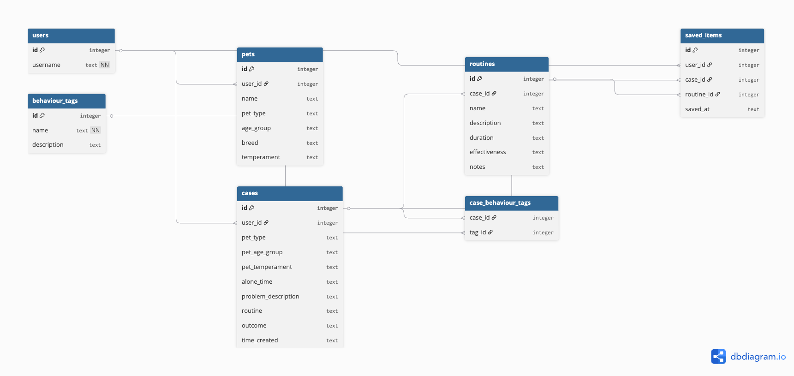

This week's tutorial pushed us to think about the project from the data side, moving from a general concept to something more concrete and technically grounded. The process was wireframe → Data Definition Documents (DDDs) → Entity Relationship Diagram (ERD), and working through it revealed a few things we hadn't fully thought through yet.

## What we designed
We ended up with **seven DDDs** covering the main entities:
- User
- Pet
- Cases
- Routine
- Behaviour Tag
- Case-Behaviour
- Saved Case

The most important design decision was around **Cases**. I'd initially thought of a case as the current user's pet profile, but it's actually the opposite: a community-submitted experience. Someone has a dog with separation anxiety, tries a routine, and posts the result. Other users then search for cases that match their own situation. That distinction changed how we structured the data significantly.

We also decided to make **Behaviour Tags** a separate entity rather than a free-text field. A plain text column couldn't support reliable filtering. You'd get "barking", "excessive barking", "barks a lot" all meaning the same thing. Making tags their own table means users pick from a controlled list, which is what makes the matching actually work.

## The ERD
Our current schema has seven tables:

```sql
users, pets, cases, routines, behaviour_tags,
case_behaviour_tags,  -- junction table (cases <> tags, many-to-many)
saved_items
```

Most relationships are one-to-many: one user has many pets, one case has many routines. The exception is cases and behaviour tags, which required a junction table for the many-to-many relationship.

We used **dbdiagram.io** to render the ERD visually, which made it easier to catch gaps in the written DDDs.



## What's still unclear
The matching logic itself. Right now the schema supports filtering by pet type, age, and behaviour tags, but we haven't figured out how the system actually surfaces results yet. A simple filtered query might be enough, but we need to test whether that returns results that feel useful or just returns everything.

There's also an access question worth flagging: cases should only be editable by the user who submitted them. The session already stores each user's information, so this should be something we can handle through the routes, but it needs to be built in from the start rather than added later.